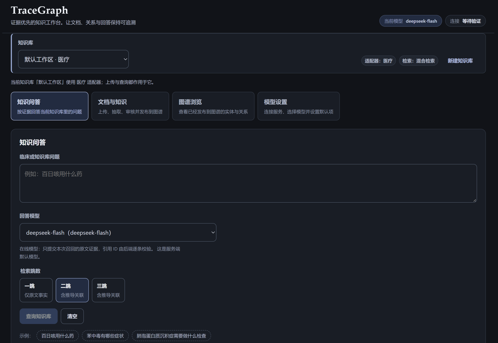
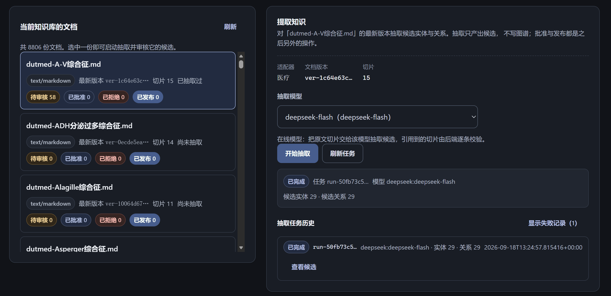
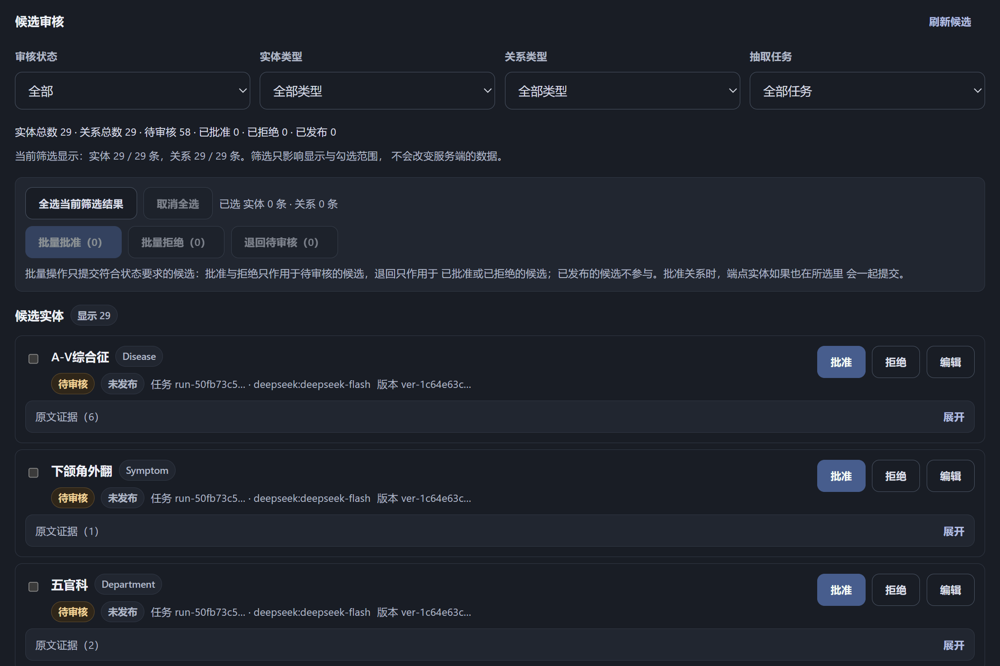
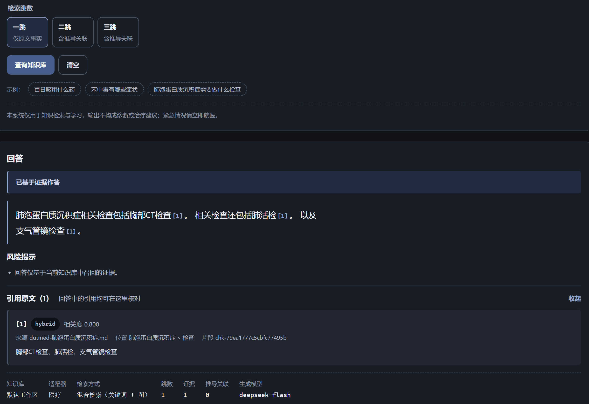
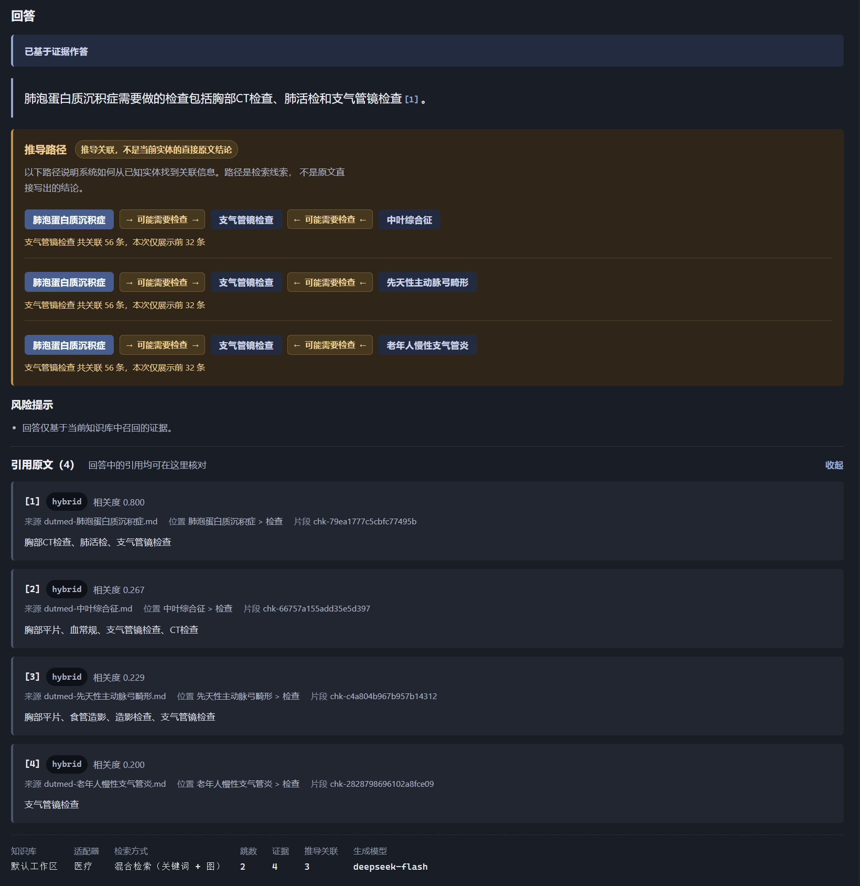

<div align="center">
  <h1>TraceGraph</h1>
  <p><strong>让知识库的每一个回答，都能沿着证据回到原文</strong></p>
  <p>面向真实文档的 Evidence-first GraphRAG 原型</p>
  <p>
    
    
    
    
  </p>
</div>



TraceGraph 把文档、知识图谱和大模型连接成一条可核验的知识链路。它不只返回一段看起来合理的文字，还会保留文档版本、原文片段、实体关系和多跳推导路径，让用户知道答案从哪里来、经过了什么推导。

项目内置 DUTMed 的少量真实记录作为开箱演示，但 **TraceGraph 不是医疗系统**。医疗数据只是第一个参考场景；通过独立知识库和领域适配器，同一套流程也可以用于个人笔记、研究资料、产品文档或其他专业知识库。

## 为什么是 TraceGraph

普通 RAG 更擅长“找到相似文本并生成回答”，但在真实知识库里，还需要回答这些问题：

- 这句话由哪一段原文支持？
- 图关系是确定性事实，还是模型推导出的关联？
- 模型抽取错误时，谁来阻止错误知识进入图谱？
- 换一个知识领域后，哪些规则需要替换，哪些基础设施可以复用？

TraceGraph 的核心原则是：**文本先入库、候选先审核、关系后发布、回答必带证据。**

## 核心能力

- **文档知识库**：支持 TXT、Markdown、JSON、JSONL、CSV 和带文本层的 PDF。
- **可追溯问答**：回答标注引用，可以展开查看来源文档和原文片段。
- **混合与多跳检索**：结合文本和图关系查找信息，最多支持 3 跳关联路径。
- **知识审核**：模型先生成候选实体和关系，人工确认后才进入正式图谱。
- **多个知识库**：不同知识库的文档、图谱和检索结果彼此隔离。
- **模型切换**：既可完全离线使用，也可在前端连接兼容的大模型服务。
- **可替换场景**：通过领域适配器扩展到个人笔记、研究资料或其他专业文档。

## 快速开始

### 环境要求

- Windows 10/11
- Python 3.11 或更高版本
- Node.js 18 或更高版本

克隆仓库后，在项目根目录执行：

```powershell
git clone https://github.com/feiyu1104/TraceGraph.git
cd TraceGraph
powershell -ExecutionPolicy Bypass -File .\setup.ps1
```

脚本会自动安装依赖、生成本机配置、构建前端、导入 3 条真实 DUTMed 演示记录，并以 SQLite 离线模式启动应用。

打开：<http://127.0.0.1:8000/app>

首次运行不需要 API Key、Java 或 Neo4j。脚本可以安全地重复执行。

仅安装、不立即启动：

```powershell
.\setup.ps1 -NoStart
```

以后再次启动：

```powershell
.\start.ps1 -Mode sqlite
```

可以尝试：

- `苯中毒需要做什么检查？`
- `百日咳有哪些症状？`
- 切换为二跳或三跳，观察“直接原文事实”和“图路径推导关联”的区别。

## 工作流程

<table>
<thead><tr><th>1 · 导入</th><th>→</th><th>2 · 抽取</th><th>→</th><th>3 · 审核</th><th>→</th><th>4 · 发布</th><th>→</th><th>5 · 问答</th></tr></thead>
<tbody><tr><td>保存文档并分段</td><td>→</td><td>识别实体与关系</td><td>→</td><td>人工修改、批准或拒绝</td><td>→</td><td>写入知识图谱</td><td>→</td><td>查找证据、生成回答并标注引用</td></tr></tbody>
</table>

上传的文档会立即进入文本知识库，可以参与关键词检索；模型抽取出来的实体和关系不会直接污染图谱。只有审核通过并显式发布的候选，才会进入图关系检索和多跳路径。



抽取只产出候选。进入候选审核后，可以按审核状态、实体类型、关系类型和抽取任务筛选，再逐条或批量批准、拒绝：



## 系统架构

<table>
<tr><th colspan="5">🔵 用户层</th></tr>
<tr><td colspan="5" align="center"><strong>React Web App</strong><br><sub>知识问答 · 文档与知识 · 图谱浏览 · 模型设置</sub></td></tr>
<tr><td colspan="5" align="center">↓ HTTP / JSON ↓</td></tr>
<tr><th colspan="5">🟠 应用层 · FastAPI</th></tr>
<tr><td align="center">知识库管理</td><td align="center">文档入库</td><td align="center">候选审核</td><td align="center">知识发布</td><td align="center">问答与反馈</td></tr>
<tr><td colspan="5" align="center">↓ 统一的知识与证据格式 ↓</td></tr>
<tr><th colspan="5">🟣 检索与回答层</th></tr>
<tr><td align="center">领域适配器<br><sub>类型与规则</sub></td><td align="center">文本检索</td><td align="center">图关系检索<br><sub>1–3 跳路径</sub></td><td align="center">结果融合</td><td align="center">回答生成<br><sub>引用校验</sub></td></tr>
<tr><td colspan="5" align="center">↓</td></tr>
<tr><th colspan="5">⚪ 数据层</th></tr>
<tr><td colspan="2" align="center"><strong>SQLite</strong><br><sub>知识库 · 文档 · 片段 · 候选 · 反馈 · 默认图谱</sub></td><td align="center"><strong>原始文档</strong><br><sub>本机文件目录</sub></td><td colspan="2" align="center"><strong>Neo4j（可选）</strong><br><sub>实体 · 关系 · 证据位置</sub></td></tr>
<tr><td colspan="5" align="center">↕</td></tr>
<tr><th colspan="5">可选外部服务</th></tr>
<tr><td colspan="5" align="center">OpenAI-compatible 模型服务 · 自建模型网关 · 本地模型服务</td></tr>
</table>

原文由文档库统一管理，图关系只记录对应的证据位置，避免重复保存正文。

## 回答为什么可追溯

一次回答由三部分组成：

1. **完整回答**：由模型基于已召回证据组织成自然语言；
2. **推导路径**：多跳模式下单独展示关联路径，不把推导冒充原文事实；
3. **原文证据**：统一列出文档、章节位置和原始片段。

单跳模式下只有原文事实：



切到二跳，系统把推导关联单独放一块，并注明它不是原文本的直接结论：



证据不足或相互冲突时，系统会明确提示，而不是用一段流畅文字掩盖不确定性。

## 接入大模型

默认的 `extractive` 模式完全离线，只整理召回证据。普通用户接入在线模型时，**不需要手动修改 `.env`**：

1. 启动 TraceGraph，打开网页中的“模型设置”；
2. 选择常见服务类型或自定义 OpenAI-compatible 地址；
3. 填写 API Key，获取模型列表；
4. 选择模型、保存连接，并按需设为默认模型。

保存后立即生效，不需要重启。连接信息只保存在本机，并已被 Git 排除。

服务端统一使用 OpenAI-compatible `/chat/completions` 协议，因此不在业务代码里绑定某一家模型厂商。

`setup.ps1` 会自动生成运行所需的 `.env`，普通用户不需要手动修改它。密钥与本机数据的安全说明见 [SECURITY.md](SECURITY.md)。

## 可选 Neo4j

SQLite 已经支持实体、关系和多跳查询，适合直接体验。需要使用 Neo4j 时，先安装 Neo4j 和兼容的 JDK，再安装图数据库驱动：

```powershell
.\.venv\Scripts\python.exe -m pip install -e ".[graph]"
```

按照 [.env.example](.env.example) 中的 Neo4j 部分填写本机地址、账号、密码和安装路径，然后启动：

```powershell
.\start.ps1 -Mode neo4j
```

需要停止时运行 `.\stop-neo4j.ps1`。如果 Neo4j 无法连接，系统会明确提示，不会悄悄切换数据源。

## 领域适配器

医疗适配器只是参考实现。适配器定义一个场景允许出现的实体、关系和处理规则；每个知识库还可以调整自己的实体与关系类型。因此，更换到个人笔记、研究资料或企业文档时，不需要重写文档存储、审核、检索和回答流程。

适配器结构见 [DOMAIN_ADAPTER.md](DOMAIN_ADAPTER.md)。

## 本地数据

以下内容只保存在用户电脑上，不会进入版本库：

- `.env`：本机环境变量与密钥；
- `data/local/`：SQLite 数据库和本机模型连接；
- `data/workspaces/`：用户上传的原始文档；

## 数据与免责声明

仓库内的 `examples/data/dutmed-demo.jsonl` 包含 3 条未修改的 DUTMed 记录，用于验证文档检索和图关系链路，不是生成数据。DUTMed 依据 Apache License 2.0 分发，其许可原文保存在 [examples/data/DUTMED-LICENSE.txt](examples/data/DUTMED-LICENSE.txt)。

演示内容仅用于软件开发、检索验证和学习，不构成医疗建议，也不能替代专业诊断。

## License

TraceGraph 使用 [Apache License 2.0](LICENSE) 开源。

第三方演示数据的归属与许可见 [NOTICE](NOTICE) 和 [examples/data/DUTMED-LICENSE.txt](examples/data/DUTMED-LICENSE.txt)。
